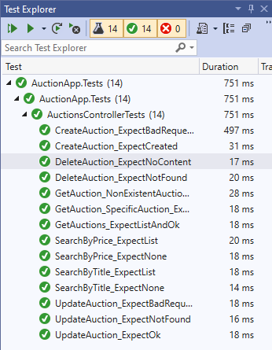

# Server-Side APIs: Part 2 Exercise (C#)

In this exercise, you'll add on to the auctions application you previously worked on. When you first built out the application, you added the ability to list, get, and search auctions by title and current bid. In this exercise, you’ll add the ability to update and delete auctions. You’ll also need to perform data validation to inform the client of any problems.

## Step One: Open solution and explore starting code

Before you begin, open the `Server-Side-APIs-Part-2-Exercise.sln` solution and review it. The code should look familiar to you as it's a continuation of the previous exercise.

### AuctionsController.cs

Note that the `Get()` method now returns a `404` response status code if the auction doesn't exist, and specifically, returns `200` when it does.

### Auction.cs

The `IsValid` property has been removed from the `Auction` class. You'll add data validation to the class in this exercise.

### Tests

The `AuctionApp.Tests` project contains the `AuctionsControllerTest` class. It contains the tests you’ll write for this exercise, as well as tests for the existing methods. More tests pass after you complete each step.

Feel free to run the server and test the application in the browser, or in Postman. However, your focus should be on making sure the tests pass.

## Step Two: Modify the `Create()` method

First, work on the `Create()` method in `AuctionsController.cs`. Instead of returning `dao.Create(auction);`, call the method and store the return value in a variable. When a new auction has been created, you’ll need to send a status code of `201 Created` back to the client. Remember that you need to send the location of the new resource and the resource itself back with that request.

After you complete this step, the `CreateAuction_ExpectCreated` test passes.

## Step Three: Add auction data validation

To get the `CreateAuction_ExpectBadRequest` test to pass, you'd think you'd need to return `400 Bad Request` if some condition were true. However, you can send a blank title, description, and user, and because there’s no data validation, the system creates one.

Add these rules to `Auction.cs`:

- title
  - rule: Required
  - message: "The field `title` should not be blank."
- description
  - rule: Required
  - message: "The field `description` should not be blank."
- user
  - rule: Required
  - message: "The field `user` should not be blank."
- currentBid
  - rule: Range
  - message: "The field `current bid` should be greater than 0."

If completed properly, the `CreateAuction_ExpectBadRequest` test now passes.

## Step Four: Implement the `Update()` method

This method updates a specific auction. The new auction is passed in as an argument.

In `AuctionsController.cs`, create a method named `Update()` that accepts an `Auction`, the auction’s ID, and returns the updated `Auction` in an `ActionResult`. Then add the attribute to this method so it responds to `PUT` requests for `/auctions` with a number following it, like `/auctions/7`. This number needs to map to the auction ID that's the method parameter.

This method must also:

* Return an `Auction` from `dao.Update()`, passing it the auction and ID that was passed to the method.
* Be able to respond to the client with the proper status code when an invalid ID is passed to it.

After you complete this step, the `UpdateAuction_ExpectOk`, `UpdateAuction_ExpectBadRequest`, and `UpdateAuction_ExpectNotFound` tests pass.

## Step Five: Implement the `Delete()` method

This method deletes a specific auction.

In `AuctionsController.cs`, create a method named `Delete()` that accepts an `int` and returns an `ActionResult`. Then add the attribute to the method so it responds to `DELETE` requests for `/auctions` with a number following it. This number needs to map to the auction ID that's the method parameter.

This method must also:

* Call `dao.Delete()`, passing it the ID that was passed to the method.
* Send a `204(No Content)` status code back to the client, as the method doesn’t return a value.
* Be able to respond to the client with the proper status code when an invalid auction ID is passed to it.

If completed properly, the `DeleteAuction_ExpectNoContent` and `DeleteAuction_ExpectNotFound` tests pass.

---

If you followed the instructions correctly, all tests now pass.

