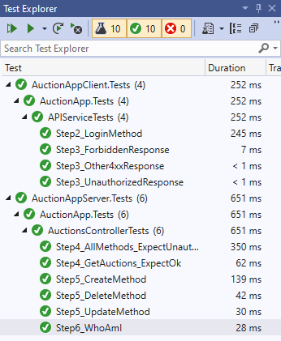

# Authentication Exercise (C#)

In this exercise, you'll continue to work on to the auctions server and client applications. Now that the API and client have been built, you'll add authentication and authorization to them.

Feel free to refer to the student book or tutorial for guidance.

## Step One: Open solution and explore starting code

Before you begin, open the `AuctionApp.sln` solution. The solution contains both the server and client projects from the previous days. Review both projects. The code should look familiar to you as it's a continuation of previous exercises.

### Set startup projects

Since both applications are included in the solution, you'll have to configure the solution to run both projects simultaneously. In Visual Studio, right-click the solution and select "properties." In the window that appears, select "Multiple startup projects" and set both "AuctionAppServer" and "AuctionAppClient" to have the action `Start`. You can leave the test projects set to `None`.

### Additional classes

A few classes have been added to the server project to support logging in. `LoginController` has been added to provide a login endpoint. These are the same classes that were added to the tutorial and lecture.

Similarly, some code has been added to the client project to provide you a way to log in, but you'll write the login method this time.

### Tests

There are two test projects: `AuctionAppServer.Tests` and `AuctionAppClient.Tests`. You'll be told which project has the test to run for each step.

Feel free to run the server and test the applications together or in Postman. However, your focus should be on making sure the tests pass.

> Note: You must stop the client and server to run the tests. Visual Studio disables testing while the server and client run.

## Step Two: Complete the login method

In the `AuctionAppClient` project, open `APIService.cs`, and locate the `Login()` method.

The response handling is already created for you, but you have to create the request. You need to send a `POST` request to the login endpoint `/login` with an object that has `username` and `password` fields.

Once you receive the response, you need to add the JWT token to the RestSharp client in the class.

After you complete this step, the `Step2_LoginMethod` test in `AuctionAppClient.Tests` passes.

> Note: If you're having trouble with this, you can go back to the tutorial and see what the `Login()` method should look like.

You can test the client application by logging in with `test/test` or `admin/admin` as the username and password.

## Step Three: Add handling of unauthorized and forbidden responses

In `APIService.cs`, locate the `ProcessErrorResponse()` method. In the `else if (!response.IsSuccessful)` block, you'll need to add checks for the response status code and throw the appropriate exception:

* If the status is `Unauthorized` and `Forbidden`, throw the corresponding `UnauthorizedException` or `ForbiddenException` passing in an appropriate error message for the user.
* If the status is neither of those but still unsuccessful, throw `NonSuccessException` passing in the status code.

After you complete this step, the `Step3_ForbiddenResponse`, `Step3_UnauthorizedResponse`, and `Step3_Other4xxResponse` tests in `AuctionAppClient.Tests` pass.

> Note: If you need to review checking response codes in the client, you can refer to the [Response status](https://book.techelevator.com/v2_3/content/web-services-consuming-get.html#response-status) section in the Consuming Web APIs with GET chapter.

## Step Four: Add authentication to controller methods

In the `AuctionAppServer` project, open `AuctionsController.cs`. All methods must require authentication except `List()`, the method that responds to `/auctions`. See if you can accomplish this by only adding two lines to the class.

After you complete this step, the `Step4_AllMethods_ExpectUnauthorized` and `Step4_GetAuctions_ExpectOk` tests in `AuctionAppServer.Tests` pass.

## Step Five: Add authorization roles

In `AuctionsController.cs`, add the following authorization rules:

- `Create()`: allow `creator` and `admin` roles
- `Update()`: allow `creator` and `admin` roles
- `Delete()`: allow `admin` role

After you complete this step, the `Step5_CreateMethod`, `Step5_UpdateMethod`, and `Step5_DeleteMethod` tests in `AuctionAppServer.Tests` pass.

## Step Six: Return user identity

In `AuctionsController.cs`, locate the `WhoAmI()` method. Instead of returning an empty string, return the logged in user's name.

After you complete this step, the `Step6_WhoAmI` test in `AuctionAppServer.Tests` passes.

---

If you followed the instructions correctly, all tests now pass.

