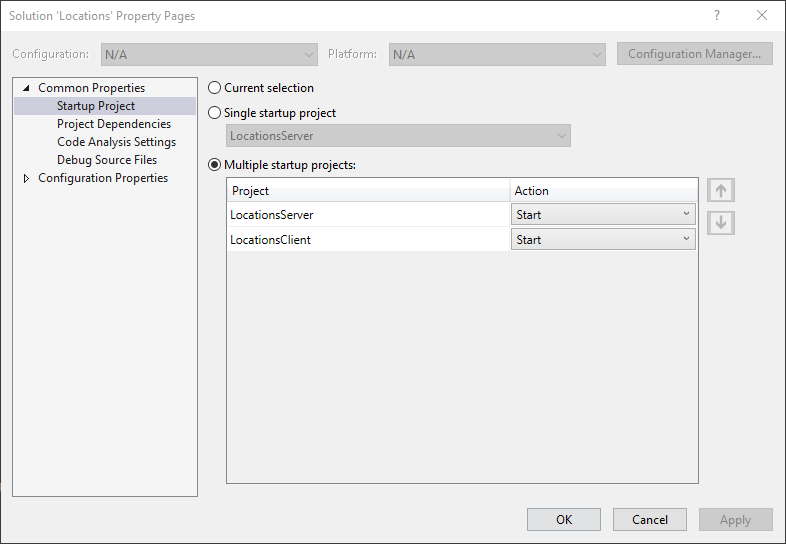
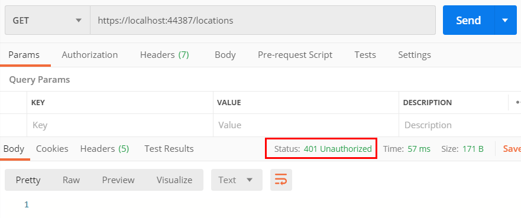
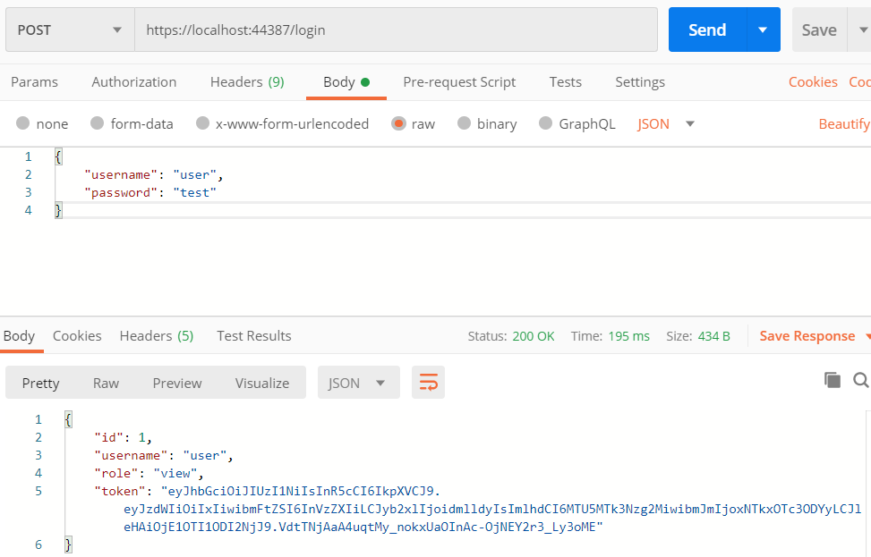
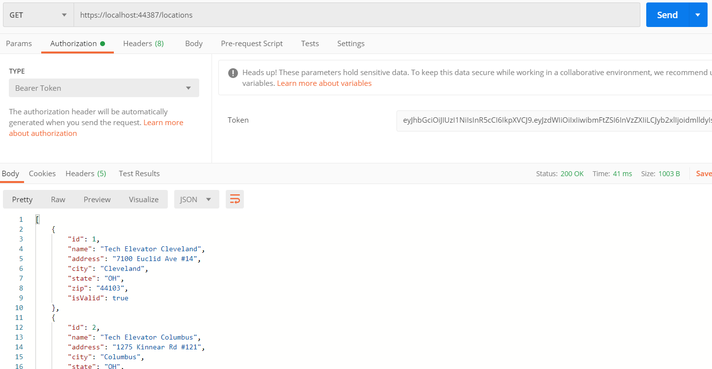

# Authentication Tutorial (C#)

In this tutorial, you'll continue working on an application that uses Tech Elevator Locations as the data model. You'll add the ability to log in to the client application and send the authentication token with any request.

## Step One: Open solution and explore starting code

Before you begin, open the `Locations.sln` solution. The solution contains both the server and client projects from the previous days. Review both projects. The code should look familiar to you as it's a continuation of the previous tutorials.

### Set startup projects

Since both applications are included in the solution, you'll have to configure the solution to run both projects simultaneously. In Visual Studio, right-click on the solution and select "properties." In the window that appears, select "Multiple startup projects" and set both "LocationsServer" and "LocationsClient" to have the action, `Start`.



### Server

The server application should look familiar to you as it picks up where you left off in the previous tutorial. There's a new folder called `Security` that contains the code needed to implement authentication.

### Client

If you run the application, you'll notice the new menu option, option 6, for logging in:

```
Welcome to Tech Elevator Locations. Please make a selection.

1: List Tech Elevator Locations
2: Show Tech Elevator Location Details
3: Add a Tech Elevator Location
4: Update a Tech Elevator Location
5: Delete a Tech Elevator Location
6: Log in
0: Exit
```

If you have time, examine the code that makes this login feature work.

Open `APIService.cs` and notice two lines of code have been added to the top of the class:

```csharp
private API_User user = new API_User();

public bool LoggedIn { get { return !string.IsNullOrWhiteSpace(user.Token); } }
```

The `API_User` class has three properties: `Username`, `Token`, and `Message`. These fields map to the expected responses from the login endpoint of the server—`Username` and `Token` are returned for successful logins, and `Message` is returned for un-successful logins. 

The `private API_User user` is declared here to store the login token for requests. The `LoggedIn` property shares the login status with `Program.cs` so it can change "Log in" to "Log out" on the menu.

Next, look at the `Login()` method of `APIService.cs`:

```csharp
public bool Login(string submittedName, string submittedPass)
{
    var credentials = new { username = submittedName, password = submittedPass }; //this gets converted to JSON by RestSharp
    RestClient client = new RestClient(API_BASE);
    RestRequest request = new RestRequest("/login");
    request.AddJsonBody(credentials);
    IRestResponse<API_User> response = client.Post<API_User>(request);

    if (response.ResponseStatus != ResponseStatus.Completed) {
        Console.WriteLine("An error occurred communicating with the server.");
        return false;
    } else if (!response.IsSuccessful) {
        if (!string.IsNullOrWhiteSpace(response.Data.Message)) {
            Console.WriteLine("An error message was received: " + response.Data.Message);
        } else {
            Console.WriteLine("An error response was received from the server. The status code is " + (int)response.StatusCode);
        }
        return false;
    } else {
        user.Token = response.Data.Token;

        return true;
    }
}
```

If you successfully log in, you'll receive an authentication token in `response.Data.Token`. You'll recall that `response.Data` is the deserialized object from the API response. You'll take that token and set it to the `.Token` property of the `private user` property in the class.

## Step Two: Run the applications

Now that you've set up your projects in Visual Studio and reviewed the starting code, run both of them to make sure everything works. It's best to make sure the application runs before adding anything new to it.

## Step Three: Test the REST API in Postman

After starting the server application, you'll need to test the REST API in Postman before writing any client code. Open Postman and try to get a list of locations by visiting `https://localhost:44387/locations`. This and every request mapping in the `LocationsController` returns a `401 Unauthorized` response.



Before sending any requests to the API, you need to log in and then use the authentication token that's sent back to you in any subsequent requests. Start by sending a `POST` request to `/login` with a JSON object with `username` and `password` fields. There's a user in the system with a username of `user` and a password of `test`.



> Note: If you send a bad username and password, what happens?

The response is a JSON object with the token located in the key `token`. You want to copy everything inside the double quotes because this is your authentication token. Now you can go back to the `GET` locations request that failed.

Under "Authorization", select the type `Bearer Token` and paste your token into the token field. This time, you'll pass authentication and receive a list of locations.



## Step Four: List all locations

Now that you've tested the API using Postman, you should know what you need to do in the client. You'll need to log in using the client application, store the authentication token, and then pass that token in an authorization header each time you make a call to the API.

Start by running the client application and selecting option 1 to list all of the locations. As expected, you receive a `401 Unauthorized` response:

```
Please choose an option: 1
An error response was received from the server. The status code is 401
```

### Location Service

Open `APIService.cs` and locate the `GetAllLocations()` method. To pass the authentication token, you need to create a new `JwtAuthenticator` instance, passing it the `user.Token` that was saved during the `Login()` method. Once you've created the `JwtAuthenticator`, set it to the `client.Authenticator` property. RestSharp automatically sets the `Authorization` HTTP header with the token and type:

```csharp
public List<Location> GetAllLocations()
{
    RestClient client = new RestClient();
    if (!string.IsNullOrWhiteSpace(user.Token)) //make sure Token isn't null or empty
    {
        JwtAuthenticator jwt = new JwtAuthenticator(user.Token);
        client.Authenticator = jwt;
    }
    RestRequest request = new RestRequest(API_URL);
    IRestResponse<List<Location>> response = client.Get<List<Location>>(request);

    if (response.ResponseStatus != ResponseStatus.Completed)
    {
        ...
```

Run the client application, log in, and then try to list all of the locations.

## Step Five: Get a single location

If you try to get the details for a single location, you'll receive the same `401 Unauthorized` response. In `APIService.cs`, find the `GetDetailsForLocation()` method. The changes you need to make here are similar to the ones you made for the `GetAllLocations()` method. Try to update this method on your own before looking at the answer below:

```csharp
public Location GetDetailsForLocation(int locationId)
{
    RestClient client = new RestClient();
    if (!string.IsNullOrWhiteSpace(user.Token)) //make sure Token isn't null or empty
    {
        JwtAuthenticator jwt = new JwtAuthenticator(user.Token);
        client.Authenticator = jwt;
    }
    RestRequest requestOne = new RestRequest(API_URL + "/" + locationId);
    IRestResponse<Location> response = client.Get<Location>(requestOne);

    if (response.ResponseStatus != ResponseStatus.Completed)
    {
        ...
```

> Note: If you're having trouble with this, here's a tip that may help: run the program in debug mode and place breakpoints in the `APIService.cs` methods `GetAllLocations()` or `GetDetailsForLocation()`. Step through the execution of the program line by line to see what's happening.

## Step Six: Refactor authorization

Whenever you duplicate code, you should ask yourself, "Is there an opportunity to refactor this?"

The answer is usually, "yes."

You used the same lines of code for each of the previous methods:

```csharp
if (!string.IsNullOrWhiteSpace(user.Token))
{
    JwtAuthenticator jwt = new JwtAuthenticator(user.Token);
    client.Authenticator = jwt;
}
```

You could extract that code into a new method, but you'd need to pass the RestClient to the method since a new RestClient is instantiated in each method. Instead, you can declare one RestClient for the whole class and you'd only need to set the `Authenticator` once.

Declare a new `private static RestClient` called `authClient` and add it to the top of the class with the other class-level variables:

```csharp
public class APIService
{
    const string API_BASE = "https://localhost:44387";
    const string API_URL = API_BASE + "/locations";
    private API_User user = new API_User();
    private static RestClient authClient = new RestClient();

    ...
```

Go back to the `Login()` method, and add `authClient.Authenticator = new JwtAuthenticator(user.Token);` to the `else` block where the token was retrieved:

```csharp
} else {
    user.Token = response.Data.Token;
    authClient.Authenticator = new JwtAuthenticator(user.Token);
    return true;
}
```

In your `GET` methods, remove the RestClient `client` declaration and the `Authenticator` code you added. Change `client.Get()` to `authClient.Get()`:

```csharp
public List<Location> GetAllLocations()
{
    RestRequest request = new RestRequest(API_URL);
    IRestResponse<List<Location>> response = authClient.Get<List<Location>>(request);

    if (response.ResponseStatus != ResponseStatus.Completed)

    ...
}

public Location GetDetailsForLocation(int locationId)
{
    RestRequest requestOne = new RestRequest(API_URL + "/" + locationId);
    IRestResponse<Location> response = authClient.Get<Location>(requestOne);

    if (response.ResponseStatus != ResponseStatus.Completed)

    ...
}
```

Now, you can re-run your application and see that you can still get successful responses for menu options one and two after you log in.

## Step Seven: Create, update, and delete locations

The `AddLocation()`, `UpdateLocation()`, and `DeleteLocation()` methods also need to provide authentication. In each method, remove the `RestClient client` declaration and replace it with `authClient` like you did in the two previous methods. Try to do this on your own before looking at the answers below:

```csharp
public Location AddLocation(Location newLocation)
{
    RestRequest request = new RestRequest(API_URL);
    request.AddJsonBody(newLocation);
    IRestResponse<Location> response = authClient.Post<Location>(request);

    ...
}

public Location UpdateLocation(Location locationToUpdate)
{
    RestRequest request = new RestRequest(API_URL + "/" + locationToUpdate.Id);
    request.AddJsonBody(locationToUpdate);
    IRestResponse<Location> response = authClient.Put<Location>(request);

    ...
}

public void DeleteLocation(int locationId)
{
    RestRequest request = new RestRequest(API_URL + "/" + locationId);
    IRestResponse response = authClient.Delete(request);

    ...
}
```

Now, you can run the client and server again. If you encounter problems, review the steps again to ensure that you completed each step correctly. If the requests work in Postman, but not in the client, you might need to review the code you added.

## Summary

In this tutorial, you learned:

- How to test a secure API using Postman
- How to retrieve a JWT from an API
- How to send an authentication token using RestSharp
